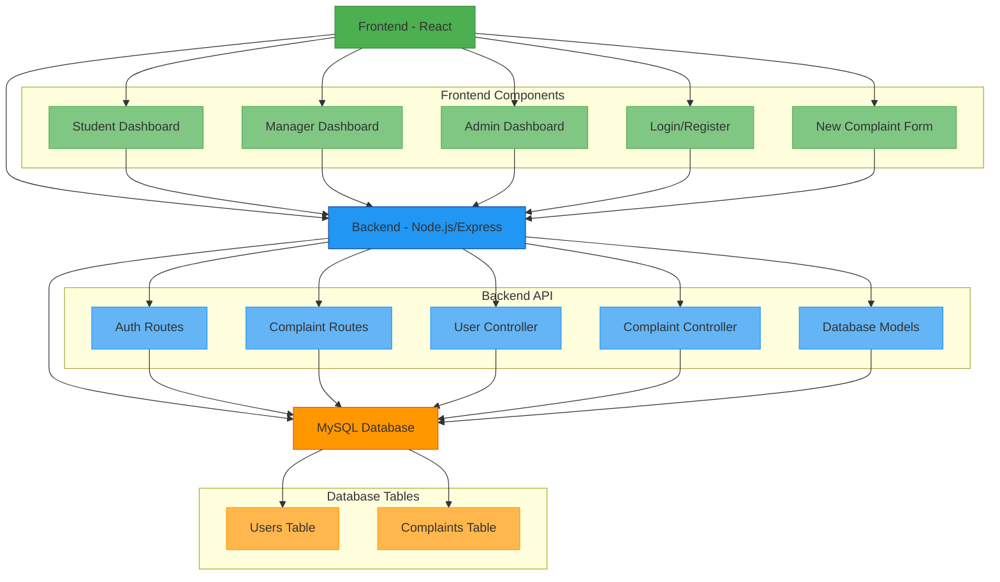
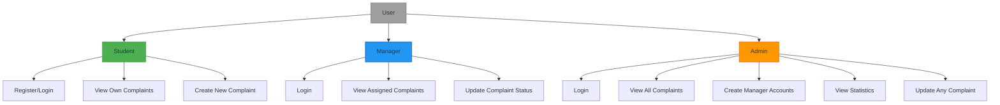
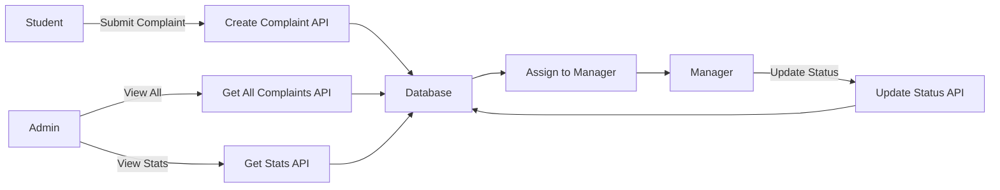

# Campus Care System Architecture

```mermaid
graph TD
    A[Frontend - React] --> B[Backend - Node.js/Express]
    B --> C[MySQL Database]
    
    subgraph "Frontend Components"
        A1[Student Dashboard]
        A2[Manager Dashboard]
        A3[Admin Dashboard]
        A4[Login/Register]
        A5[New Complaint Form]
    end
    
    subgraph "Backend API"
        B1[Auth Routes]
        B2[Complaint Routes]
        B3[User Controller]
        B4[Complaint Controller]
        B5[Database Models]
    end
    
    subgraph "Database Tables"
        C1[Users Table]
        C2[Complaints Table]
    end
    
    A --> A1 & A2 & A3 & A4 & A5
    A1 & A2 & A3 & A4 & A5 --> B
    B --> B1 & B2 & B3 & B4 & B5
    B1 & B2 & B3 & B4 & B5 --> C
    C --> C1 & C2
    
    style A fill:#4CAF50,stroke:#388E3C
    style B fill:#2196F3,stroke:#0D47A1
    style C fill:#FF9800,stroke:#E65100
    style A1 fill:#81C784,stroke:#4CAF50
    style A2 fill:#81C784,stroke:#4CAF50
    style A3 fill:#81C784,stroke:#4CAF50
    style A4 fill:#81C784,stroke:#4CAF50
    style A5 fill:#81C784,stroke:#4CAF50
    style B1 fill:#64B5F6,stroke:#2196F3
    style B2 fill:#64B5F6,stroke:#2196F3
    style B3 fill:#64B5F6,stroke:#2196F3
    style B4 fill:#64B5F6,stroke:#2196F3
    style B5 fill:#64B5F6,stroke:#2196F3
    style C1 fill:#FFB74D,stroke:#FF9800
    style C2 fill:#FFB74D,stroke:#FF9800
```

## User Roles and Permissions

```mermaid
graph TD
    U[User] --> S[Student]
    U --> M[Manager]
    U --> A[Admin]
    
    S --> S1[Register/Login]
    S --> S2[View Own Complaints]
    S --> S3[Create New Complaint]
    
    M --> M1[Login]
    M --> M2[View Assigned Complaints]
    M --> M3[Update Complaint Status]
    
    A --> A1[Login]
    A --> A2[View All Complaints]
    A --> A3[Create Manager Accounts]
    A --> A4[View Statistics]
    A --> A5[Update Any Complaint]
    
    style U fill:#9E9E9E,stroke:#616161
    style S fill:#4CAF50,stroke:#388E3C
    style M fill:#2196F3,stroke:#0D47A1
    style A fill:#FF9800,stroke:#E65100
```

## Data Flow

```mermaid
graph LR
    S[Student] -->|Submit Complaint| C[Create Complaint API]
    C --> D[Database]
    D --> E[Assign to Manager]
    E --> M[Manager]
    M -->|Update Status| F[Update Status API]
    F --> D
    A[Admin] -->|View All| G[Get All Complaints API]
    G --> D
    A -->|View Stats| H[Get Stats API]
    H --> D
```